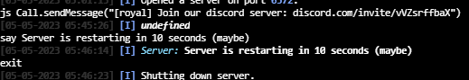

# Mindustry Plugin Deploy to Pterodactyl

Build from GitHub push and deploy to Pterodactyl server


## Usage

```yaml
name: Java CI

on: [ push ]

jobs:
  buildJar:
    runs-on: ubuntu-latest

    steps:
      - uses: actions/checkout@v1
      - name: Set up JDK 17
        uses: actions/setup-java@v1
        with:
          java-version: 17
      - name: Build plugin jar
        run: ./gradlew jar
      - name: Upload built jar file
        uses: actions/upload-artifact@v2
        with:
          name: ${{ github.event.repository.name }}
          path: build/libs/${{ github.event.repository.name }}.jar
      - name: Deploy
        uses: Itzbenz/mindustry-plugin-deploy-to-pterodactyl@016baa1e8b1210c4c61cf1235e1cdfeda469e382
        with:
          # The path to the plugin artifact
          artifact: build/libs/${{ github.event.repository.name }}.jar
          # The API endpoint of the Pterodactyl server
          endpoint: ${{ secrets.PTERODACTYL_ENDPOINT }}
          # The ID of the Pterodactyl server
          server: ${{ secrets.PTERODACTYL_SERVER_ID }}
          # The API key of the Pterodactyl server
          token: ${{ secrets.PTERODACTYL_API_KEY }}
          # Whether to restart the server after deploying the plugin
          restart: true
```

See the [actions tab](https://github.com/actions/javascript-action/actions) for runs of this action! :rocket:
